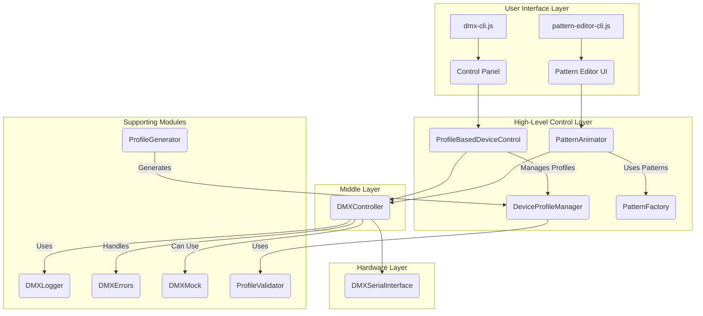

# 🎭 DMX Laser Control System v3.0

> Professional-grade DMX512 lighting control system with pattern animation, automatic device discovery, dynamic profile management, and real-time control.

[](package.json)
[](LICENSE)
[](package.json)

## 🌟 Features

### Core Capabilities
- **🔌 Automatic DMX Interface Detection** - Finds ENTTEC, FTDI, and compatible interfaces
- **📁 Dynamic Device Profile System** - JSON-based device configurations
- **🔍 Pattern Discovery Mode** - Interactive pattern mapping and profile generation
- **🎮 Real-time Control Panel** - Professional UI with presets and live monitoring
- **✅ Profile Validation** - Ensures device profiles are correct before use
- **🧪 Hardware-free Testing** - Complete mock system for development
- **📊 Comprehensive Logging** - Detailed logs for debugging

### New in v3.0
- **✨ Custom Pattern Animation** - Generate and animate custom patterns with precise control.
- **📐 Parametric Pattern Editor** - Interactive CLI for creating and editing patterns with visual feedback.
- **💾 Pattern Library Management** - Save, load, and organize your custom patterns.
- Profile-based device control (no more hardcoded values!)
- Automated profile generation from pattern discovery
- Multi-device support through profiles
- Enhanced CLI with setup wizard
- Robust error handling and recovery

## 📦 Installation

```bash
# Clone the repository
git clone https://github.com/yourusername/dmx-laser-control.git
cd dmx-laser-control

# Install dependencies
npm install

# Make CLI globally available (optional)
npm link
```

### System Requirements

- **Node.js**: v16.0.0 or higher
- **Operating System**: Windows, macOS, or Linux
- **DMX Interface**: ENTTEC DMX USB Pro, FTDI-based interfaces, or compatible
- **Permissions**: Serial port access (may require sudo on Linux/macOS)

## 🚀 Quick Start

### 1. Initial Setup

Run the interactive setup wizard to configure your laser device:

```bash
npm run setup
# or
dmx setup
```

The wizard will:
1. Help you select a device profile (or use generic)
2. Auto-detect your DMX interface
3. Configure DMX addressing
4. Test the connection with a safe pattern

### 2. Pattern Discovery

Discover and map your laser's patterns:

```bash
npm run discover
# or
dmx discover
```

This mode will:
- Cycle through DMX values on pattern channels
- Let you name patterns as you see them
- Generate a device profile JSON file
- Save discovered patterns for future use

### 3. Control Panel

Launch the interactive control interface:

```bash
npm start
# or
dmx control
```

Controls:
- **Mouse**: Click on presets and patterns
- **Arrow Keys**: Navigate sliders
- **B**: Blackout (emergency stop)
- **T**: Run test sequence
- **Q**: Quit

## 📖 Command Reference

### Main Commands

| Command | Description | Options |
|---------|-------------|---------|
| `dmx setup` | Interactive setup wizard | None |
| `dmx discover` | Pattern discovery mode | `--output <file>` |
| `dmx control` | Launch control panel | `--profile <name>` |
| `dmx pattern-editor` | Launch interactive pattern editor | `--profile <name>` |
| `dmx test` | Run test sequence | `--mock` for simulated device |

### NPM Scripts

```bash
npm start          # Launch control panel
npm run demo       # Run original demo
npm test           # Run test suite
npm run test:mock  # Test with mock device
npm run discover   # Pattern discovery
npm run setup      # Setup wizard
npm run pattern-editor # Launch interactive pattern editor
npm run animator   # Alias for pattern editor
```

## 🎮 Understanding DMX Channels

DMX512 uses 512 channels (1-512) to control lighting parameters. Here's how they typically map for laser devices:

### Common Channel Mappings

| Channel | Function | Values |
|---------|----------|--------|
| 1 | Mode | 0=Off, 50=Auto, 100=Sound, 200=DMX |
| 2 | Pattern Selection | 0-255 (device-specific) |
| 3 | Pattern Size/Zoom | 0-255 |
| 4-6 | X/Y Position | 0-255 (128=center) |
| 7-9 | RGB Color | 0-255 per channel |
| 10 | Strobe | 0=Off, 1-255=Speed |
| 11 | Rotation | 0-255 |
| 12 | Animation Speed | 0-255 |

> **Note**: Exact mappings vary by device. Use `dmx discover` to map your specific laser.

## 📁 Device Profiles

Device profiles define how your laser interprets DMX values. They're stored as JSON files in the project directory.

### Profile Structure

```json
{
  "name": "My Laser Model",
  "manufacturer": "LaserCorp",
  "channelCount": 32,
  "channels": {
    "mode": { 
      "channel": 1, 
      "type": "enum", 
      "values": {
        "off": 0,
        "auto": 50,
        "sound": 100,
        "dmx": 200
      }
    },
    "pattern": {
      "channel": 2,
      "type": "range",
      "min": 0,
      "max": 255,
      "patterns": {
        "circle": 10,
        "square": 20,
        "triangle": 30
      }
    }
  },
  "presets": {
    "test": {
      "description": "Safe test pattern",
      "channels": {
        "mode": 200,
        "pattern": 10,
        "colorRed": 255
      }
    }
  }
}
```

### Using Custom Profiles

1. Create a profile using `dmx discover`
2. Save it as `my-laser-profile.json`
3. Use it: `dmx control --profile my-laser-profile.json`

## 🧪 Testing

### With Hardware

```bash
# Run full test sequence
npm test

# Run specific test
dmx test --sequence strobe
```

### Without Hardware (Mock Mode)

```bash
# Test with simulated device
npm run test:mock

# Run unit tests
npx mocha test/**/*.test.js
```

### Writing Tests

```javascript
import { DMXTestHarness } from './dmx-mock.js';

const harness = new DMXTestHarness();
await harness.setup();

const scenario = {
  name: 'Pattern Test',
  steps: [
    { type: 'connect' },
    { type: 'send_dmx', data: [0, 255, 10] },
    { type: 'assert_state', expected: { 
      patterns: { pattern1: 'CIRCLE' } 
    }},
    { type: 'disconnect' }
  ]
};

const results = await harness.simulateScenario(scenario);
```

## 📊 Log Files

The system generates several log files for debugging:

| File | Purpose | Format |
|------|---------|--------|
| `dmx-cli.log` | Main application log | Timestamped text |
| `dmx_received_log.txt` | Raw DMX data received | Hex dumps |
| `patterns-*.json` | Discovered patterns | JSON |

### Reading Log Files

```bash
# View recent errors
grep ERROR dmx-cli.log | tail -20

# Monitor DMX traffic
tail -f dmx_received_log.txt

# Parse hex patterns
grep "RX <---" dmx_received_log.txt
```

## 🔧 Troubleshooting

### Common Issues

#### "Permission denied" on serial port
```bash
# Linux/macOS
sudo chmod 666 /dev/ttyUSB0
# or add user to dialout group
sudo usermod -a -G dialout $USER
```

#### "Port already in use"
- Close other DMX software
- Check for zombie processes: `lsof | grep tty`

#### "No serial ports detected"
1. Check USB connection
2. Install FTDI drivers if needed
3. Verify with: `ls /dev/tty*` (Linux/macOS) or Device Manager (Windows)

#### Patterns not responding
1. Ensure laser is in DMX mode (not Auto/Sound)
2. Check DMX address matches configuration
3. Verify DMX terminator is installed if needed

### Debug Mode

Enable detailed logging:

```javascript
// In your code
const logger = new DMXLogger({
  minLevel: LogLevel.TRACE,
  enableFile: true
});
```

## 🏗️ Architecture

The system employs a robust, layered architecture designed for modularity, extensibility, and ease of use, enabling precise control over DMX-compatible laser devices.



### Key Components

| Component | File | Purpose |
|-----------|------|---------|
| **CLI Interface** | `dmx-cli.js` | User interaction and commands |
| **Pattern Editor CLI** | `pattern-editor-cli.js` | Interactive editor for custom patterns |
| **Profile Control** | `dmx-profile-based-control.js` | Dynamic device control using profiles |
| **Pattern Animation** | `pattern-animator.js` | Generates and animates custom patterns |
| **Profile Manager** | `dmx-device-control.js` | Load and manage device profiles |
| **Profile Generator** | `dmx-profile-generator.js` | Create profiles from discoveries |
| **Profile Validator** | `dmx-profile-validator.js` | Validate profile correctness |
| **Core DMX** | `dmx.js` | Low-level DMX protocol handling |
| **Mock System** | `dmx-mock.js` | Testing without hardware |
| **Error Handling** | `dmx-errors.js` | Custom error types and recovery |
| **Logging** | `dmx-logger.js` | Centralized logging system |
| **Geometric Patterns** | `patterns/geometric-patterns.js` | Library of basic geometric patterns |


```
┌─────────────────────────────────┐
│         dmx-cli.js              │ ← User Interface Layer
│  (Commander CLI + Blessed UI)    │
└────────────┬────────────────────┘
             │
┌────────────▼────────────────────┐
│      LaserDeviceControl         │ ← Device Abstraction Layer
│   (High-level API + Profiles)   │
└────────────┬────────────────────┘
             │
┌────────────▼────────────────────┐
│        DMXController            │ ← Protocol Layer
│  (Channel management + Timing)  │
└────────────┬────────────────────┘
             │
┌────────────▼────────────────────┐
│      DMXSerialInterface         │ ← Hardware Layer
│    (Serial port + DMX frames)   │
└─────────────────────────────────┘
```

### Key Components

- **dmx-cli.js**: Command-line interface and UI
- **dmx.js**: Core DMX control classes
- **dmx-mock.js**: Testing infrastructure
- **dmx-errors.js**: Error handling system
- **dmx-logger.js**: Logging infrastructure
- **device-profiles.json**: Device configurations

## 🤝 Contributing

### Development Workflow

1. Fork the repository
2. Create a feature branch
3. Write tests for new features
4. Ensure all tests pass
5. Submit a pull request

### Code Style

- Use ES6+ features
- Add JSDoc comments for public APIs
- Follow existing naming conventions
- Keep functions focused and testable

### Adding Device Support

1. Use `dmx discover` to map the device
2. Create a profile JSON file
3. Add to `device-profiles/` directory
4. Submit PR with test data

## 📄 License

MIT License - see [LICENSE](LICENSE) file for details

## 🙏 Acknowledgments

- DMX512 protocol specification by USITT
- SerialPort.js community
- ENTTEC for DMX USB Pro documentation

## 📮 Support

- **Issues**: [GitHub Issues](https://github.com/yourusername/dmx-laser-control/issues)
- **Discussions**: [GitHub Discussions](https://github.com/yourusername/dmx-laser-control/discussions)
- **Email**: support@example.com

---

**Happy Lighting! 🎉🎭🎨**

*Remember: Always use laser safety glasses and follow local regulations for laser displays.*