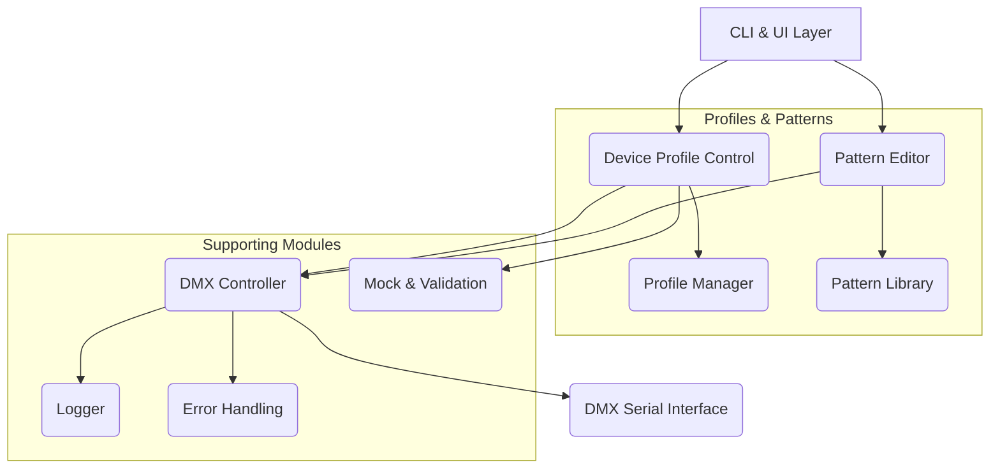
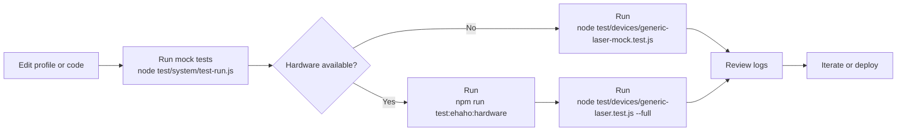

# LASER ⇄ RESAL (LR)

> LASER — **L**aser **A**utomation **S**equencing **E**ngine **R**ESAL
> RESAL — **R**ealtime **E**ffects **S**ynchronization **A**utomation **L**ASER

[](../package.json)
[](../LICENSE)
[](../package.json)

---

## Overview

This is a professional-grade DMX512 lighting framework for controlling laser projectors and lighting fixtures. It provides automatic interface detection, dynamic device profiles, guided pattern discovery, and real-time control capabilities. This framework serves as the foundation for Project PARTY's autonomous discovery system.

### Current Capabilities

• **Automatic DMX interface detection** for ENTTEC, FTDI, and compatible adapters
• **Dynamic device profile system** with JSON descriptors
• **Guided pattern discovery** for rapid profile authoring
• **Real-time control panel** with presets and live monitoring
• **Built-in profile validation** prior to live use
• **Complete mock environment** for hardware-free development
• **Centralized logging** for troubleshooting

### Version 3.0 Highlights

• Custom pattern animation engine with precise parameter control
• Parametric pattern editor via CLI
• Pattern library management with save/load/versioning
• Non-interactive setup for CI/CD environments
• Multi-fixture orchestration and priority management
• Promise-based DMX controller API
• Expanded discovery tooling with multi-channel capture
• Comprehensive test harnesses for hardware and mock scenarios

---

## Installation

```bash
# Navigate to project root
cd /path/to/party

# Install dependencies
npm install

# Quick smoke test
node test/system/test-run.js

# Optional: expose CLI globally
npm link
```

### System Requirements

• Node.js v16.0.0 or higher
• Windows, macOS, or Linux
• DMX interface (ENTTEC DMX USB Pro, FTDI-based, or compatible)
• Serial port access (may require `sudo` or group membership on Unix-like systems)

---

## Quick Start

### 1. Initial Setup

```bash
npm run setup
# or
node cli/dmx-cli.js setup
```

The setup wizard helps you:

1. Select an existing device profile or create a new one
2. Detect an attached DMX interface
3. Configure DMX addressing
4. Verify connectivity with a safe pattern

#### Non-Interactive Setup

```bash
# First run – capture configuration
node cli/dmx-cli.js setup --profile generic-laser --port /dev/ttyUSB0 --address 1 --save

# Subsequent runs – reuse saved configuration
node cli/dmx-cli.js setup --non-interactive --config ./dmx-config.json
```

### 2. Pattern Discovery

```bash
npm run discover
# or
node cli/dmx-cli.js discover --channels 2,3,4 --step 5 --capture-state --output my-patterns.json
```

Discovery cycles DMX values across selected channels, allows you to name patterns, and emits a profile JSON file for later use.

### 3. Control Interface

```bash
npm start
# or
node cli/dmx-cli.js control --profile ehaho-l2400.json --port /dev/tty.usbserial-A50285BI --address 1
```

If no port is supplied, the control command auto-selects the first detected device and defaults to DMX start address 1.

**Keyboard shortcuts:** Arrow keys for focus, `B` for blackout, `T` to run test sequence, `Q` to quit.

---

## Command Reference

### CLI Commands

| Command                  | Description                    | Selected Options                                                          |
| ------------------------ | ------------------------------ | -------------------------------------------------------------------------- |
| `dmx setup`              | Interactive setup wizard       | `--profile <id>`, `--port <path>`, `--save`, `--non-interactive`           |
| `dmx discover`           | Pattern discovery mode         | `--channels <list>`, `--step <size>`, `--capture-state`, `--output <file>` |
| `dmx control`            | Launch control panel           | `--profile <name>`, `--port <path>`, `--address <start>`                   |
| `dmx pattern`            | Launch pattern editor          | `--demo` for demo mode                                                     |
| `dmx test`               | Run test sequence              | `--mock` for simulated device                                              |
| `dmx generate`           | Profile generator              | interactive prompts                                                        |
| `dmx validate <profile>` | Validate a profile             | path to profile                                                            |
| `dmx list`               | List available profiles        | reads `device-profiles/`                                                   |

### NPM Scripts

```bash
npm start                 # Launch control panel
npm run demo              # Legacy demo sequence
npm test                  # Run unit + device tests
npm run test:ehaho        # Ehaho L2400 regression using mock serial port
npm run test:ehaho:hardware -- --port=/dev/tty.usbserial-XXXX  # Ehaho hardware validation
npm run discover          # Pattern discovery helper
npm run setup             # Setup wizard
npm run pattern-editor    # Launch interactive pattern editor
```

---

## Understanding DMX Channels

DMX512 uses channels (1–512) to control fixture parameters. Typical mappings for lasers:

| Channel | Function          | Example Values                       |
| ------- | ----------------- | ------------------------------------ |
| 1       | Mode              | 0 Off, 50 Auto, 100 Sound, 200 DMX   |
| 2       | Pattern           | 0–255 device-specific pattern codes  |
| 3       | Size / Zoom       | 0–255                                |
| 4–6     | Position          | 0–255 (128 is centered)              |
| 7–9     | RGB colour        | 0–255 per channel                    |
| 10      | Strobe            | 0 Off, 1–255 speed                   |
| 11      | Rotation          | 0–255                                |
| 12      | Animation speed   | 0–255                                |

> Exact mappings vary by device; use `dmx discover` to map your hardware accurately.

---

## Device Profiles

Profiles live in `device-profiles/` and describe how channels map to functions.

### Structure Example

```json
{
  "name": "My Laser Model",
  "manufacturer": "LaserCorp",
  "channelCount": 32,
  "channels": {
    "mode": {
      "channel": 1,
      "type": "enum",
      "values": {
        "off": 0,
        "auto": 50,
        "sound": 100,
        "dmx": 200
      }
    },
    "pattern": {
      "channel": 2,
      "type": "range",
      "min": 0,
      "max": 255,
      "patterns": {
        "circle": 10,
        "square": 20,
        "triangle": 30
      }
    }
  },
  "presets": {
    "test": {
      "description": "Safe test pattern",
      "channels": {
        "mode": 200,
        "pattern": 10,
        "colorRed": 255
      }
    }
  }
}
```

### Workflow

1. Discover channel behavior with `dmx discover`
2. Save the emitted profile to `device-profiles/`
3. Reference it via `dmx control --profile <file>`

---

## Testing

### System and Integration

• `node test/system/test-run.js` – high-level smoke test of the mock harness
• `npm run test` – unit tests plus device suites

### Device Suites

| Script                                                   | Purpose                                      |
| -------------------------------------------------------- | -------------------------------------------- |
| `npm run test:ehaho`                                     | Ehaho L2400 regression using the mock serial |
| `npm run test:ehaho:hardware -- --port=/dev/ttyUSB0`     | Ehaho L2400 hardware validation              |
| `node test/devices/ehaho-l2400.test.js --list-ports`     | Enumerate serial ports prior to testing      |
| `node test/devices/generic-laser.test.js --full`         | Generic profile hardware suite               |
| `node test/devices/generic-laser.test.js --help`         | View options such as `--port` and `--safety` |
| `node test/devices/generic-laser-mock.test.js --mock`    | Generic profile regression without hardware  |

### Mock-Only Development

• Launch `node test/devices/generic-laser-mock.test.js --channels` to inspect DMX channel effects
• Use `node test/system/test-run.js` to verify profile loading and DMX controller behavior without hardware

---

## Logs

| File                   | Description                  |
| ---------------------- | ---------------------------- |
| `dmx-cli.log`          | CLI session output           |
| `dmx_received_log.txt` | Raw DMX traffic captures     |
| `patterns-*.json`      | Generated pattern libraries  |

Useful commands:

```bash
grep ERROR dmx-cli.log | tail -20      # Inspect recent failures
tail -f dmx_received_log.txt            # Monitor DMX frames in real time
```

---

## Troubleshooting

### Serial Port Issues

```bash
# Grant temporary access on Linux/macOS
sudo chmod 666 /dev/ttyUSB0
# Preferred: add your user to the dialout/uucp group
sudo usermod -a -G dialout "$USER"
```

If the interface is reported as in use, close other DMX software and inspect with `lsof | grep tty`.

### Device Not Detected

1. Confirm the USB connection
2. Install the vendor's FTDI driver if required
3. Run `node test/devices/ehaho-l2400.test.js --list-ports`

### Pattern or Colour Misbehaviour

• Ensure the fixture is in DMX mode
• Verify the configured DMX start address
• Re-run discovery to confirm channel mapping

### Dependency Problems

```bash
npm install
```

---

## Architecture



### Testing Flow



---

## Contributing

1. Fork the repository and branch from `main`
2. Add or update tests alongside code changes
3. Run `npm test` plus relevant device suites
4. Submit a pull request with context on hardware used

### Coding Guidelines

• Prefer ES6+ syntax
• Document exported functions with JSDoc where relevant
• Keep modules focused and covered by tests

---

## License

MIT License – see [LICENSE](../LICENSE).

---

## Support

• Issues: [GitHub Issues](https://github.com/yourusername/dmx-laser-control/issues)
• Discussions: [GitHub Discussions](https://github.com/yourusername/dmx-laser-control/discussions)
• Email: support@example.com

---

**⚠ Safety Note:** Remember to follow all safety regulations and wear approved laser safety equipment during testing.
